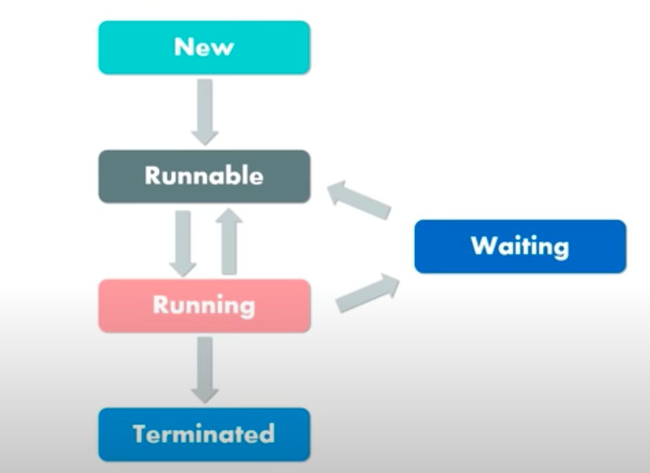
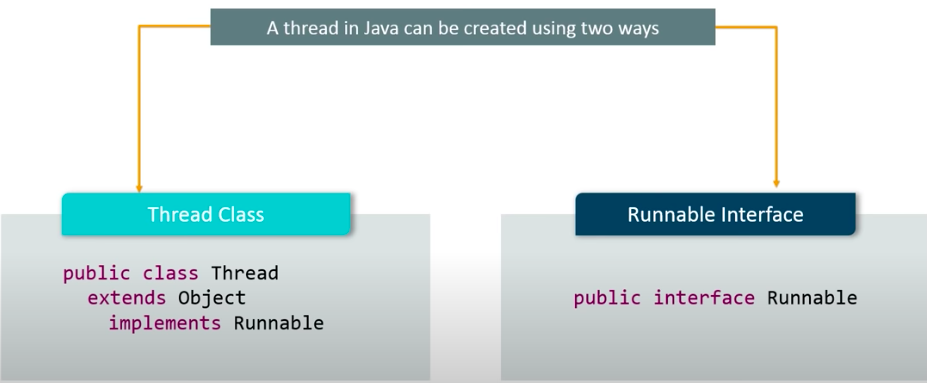
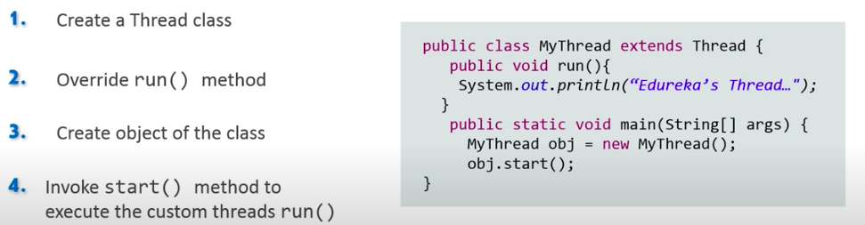
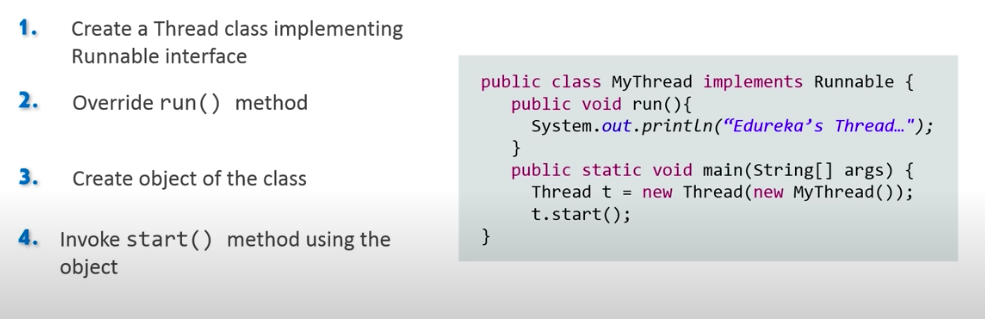

## Understanding Threads and Multi Threading

#### What is a Thread ?
- A thread is a lightweight sub-process. 
    - It is the smallest independent unit of a program.
    - It contains a seperate path of execution
    - Every java program contains at least one thread.
- In a process we have one main thread. When our application runs the OS creates a process.
- Basically the <b> Java Virtual Machine (JVM) takes care of your java processes</b> 
- Each and every process has a main thread.

#### Thread Lifecycle

- A Java thread can lie only in one of these states
    - New - A new Thread begins it's lifecycle at in this state & remains here until the program starts the thread. It is also known as a born thread.
    - Runnable - Once a newly born thread starts, the thread comes in runnable state. A thread stays in this state until it is executing it's task. 
    - Running - In this state a thread starts executing by entering the run() method and he yield() method can send it back to runnable state.
    - Waiting - Inactive state. It is still alive but unable to run. It can be waiting, sleeping or in blocked state.
    - Terminated - A runnable thread enters the terminated state it's task is completed or is stopped by force.

#### Creating a thread
- We by default have a main thread in our application created by the main method.
- So let's say you have an operation in your main block which takes a lot of time to execute and you don't want to wait for it to completely execute. This is when you would want to create a seperate thread.

- Using the Thread Class

- Using the runnable interface. (Useful since java doesn't support mulitple inheritance and you have to extend the Thread class)

